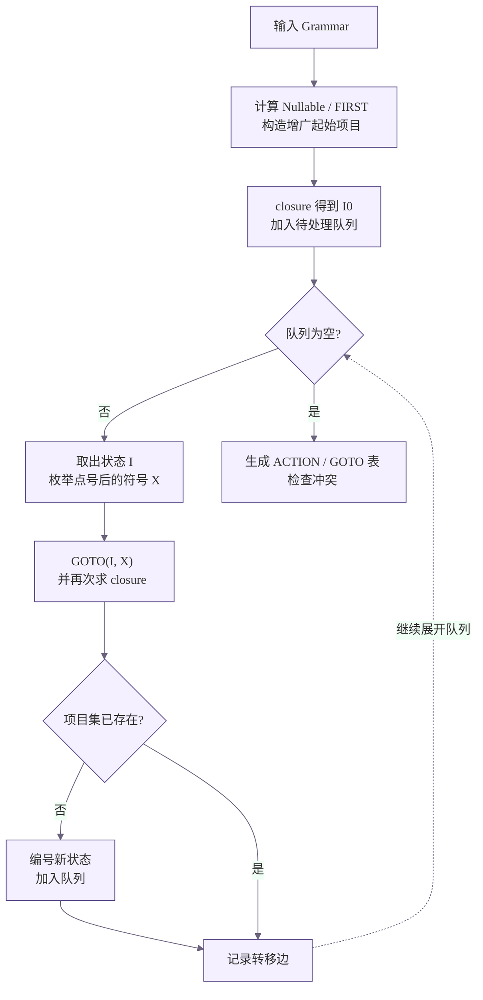

# CLR Construction

```mermaid
%%{init: {"theme": "base", "themeVariables": {"fontFamily": "Arial, PingFang SC, Microsoft YaHei, sans-serif", "primaryColor": "#f4f0ff", "primaryBorderColor": "#5b4b8a", "lineColor": "#6b627c", "tertiaryColor": "#fff9e8"}}}%%
flowchart TB
    G["输入 Grammar"]
    PRE["计算 Nullable / FIRST<br/>构造增广起始项目"]
    I0["closure 得到 I0<br/>加入待处理队列"]
    H{"队列为空?"}
    WORK["取出状态 I<br/>枚举点号后的符号 X"]
    GO["GOTO(I, X)<br/>并再次求 closure"]
    SEEN{"项目集已存在?"}
    ADD["编号新状态<br/>加入队列"]
    REC["记录转移边"]
    TAB["生成 ACTION / GOTO 表<br/>检查冲突"]

    G --> PRE --> I0 --> H
    H -->|"是"| TAB
    H -->|"否"| WORK --> GO --> SEEN
    SEEN -->|"否"| ADD --> REC
    SEEN -->|"是"| REC
    REC -. "继续展开队列" .-> H
```
