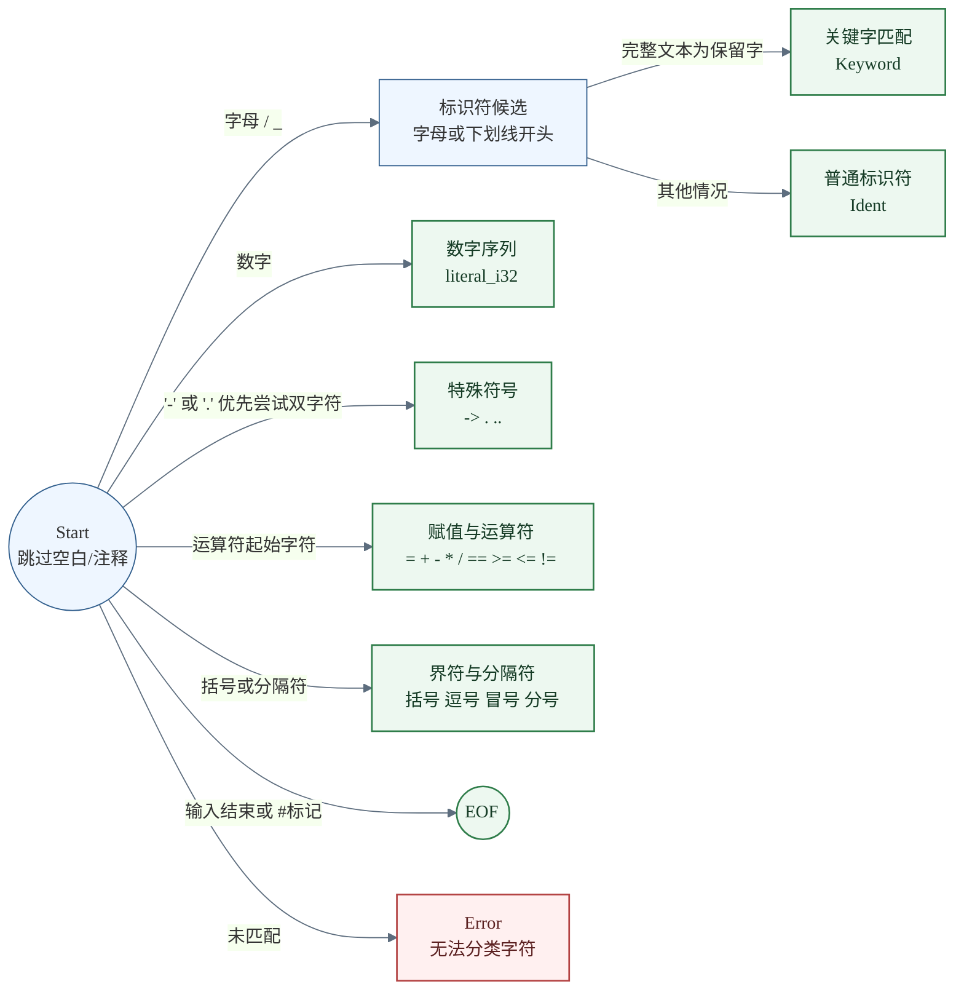

# Lexer FSM

```mermaid
%%{init: {"theme": "base", "themeVariables": {"fontFamily": "Arial, PingFang SC, Microsoft YaHei, sans-serif", "primaryColor": "#eef6ff", "primaryBorderColor": "#2f5d8c", "lineColor": "#5d6d7e", "tertiaryColor": "#f7fbff"}}}%%
flowchart LR
    S(("Start<br/>跳过空白/注释"))
    ID["标识符候选<br/>字母或下划线开头"]
    KW["关键字匹配<br/>Keyword"]
    IDENT["普通标识符<br/>Ident"]
    NUM["数字序列<br/>literal_i32"]
    SPEC["特殊符号<br/>-> . .."]
    OP["赋值与运算符<br/>= + - * / == >= <= !="]
    PUNC["界符与分隔符<br/>括号 逗号 冒号 分号"]
    EOF(("EOF"))
    ERR["Error<br/>无法分类字符"]

    S -->|"字母 / _"| ID
    ID -->|"完整文本为保留字"| KW
    ID -->|"其他情况"| IDENT
    S -->|"数字"| NUM
    S -->|"'-' 或 '.' 优先尝试双字符"| SPEC
    S -->|"运算符起始字符"| OP
    S -->|"括号或分隔符"| PUNC
    S -->|"输入结束或 #标记"| EOF
    S -->|"未匹配"| ERR

    classDef accept fill:#edf8f0,stroke:#2f7d4a,stroke-width:1.5px,color:#153b25;
    classDef error fill:#fff0f0,stroke:#b34242,stroke-width:1.5px,color:#5a1f1f;
    class KW,IDENT,NUM,SPEC,OP,PUNC,EOF accept;
    class ERR error;
```
