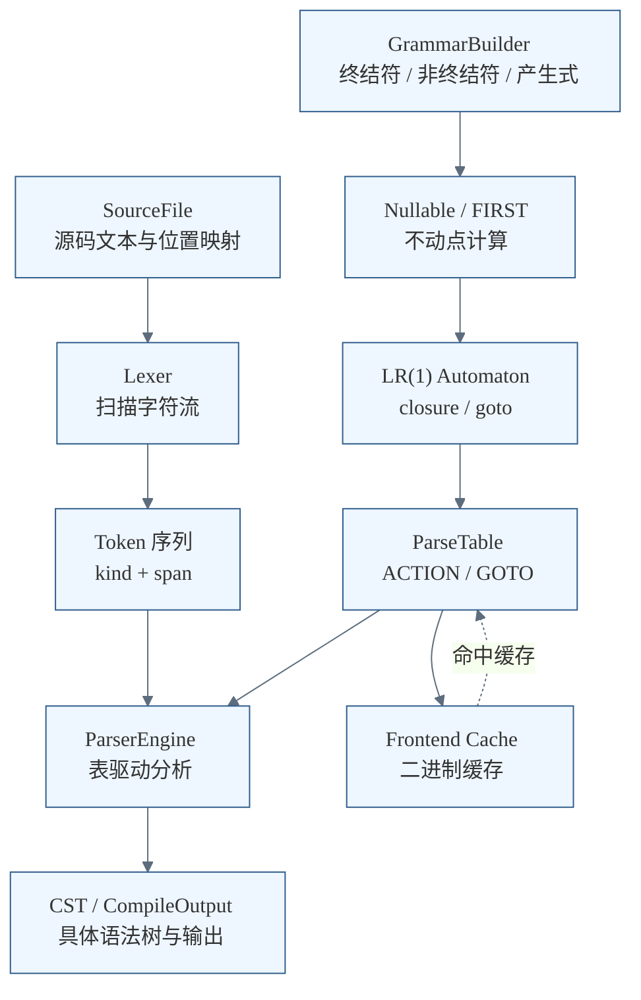

# Module Structure

```mermaid
%%{init: {"theme": "base", "themeVariables": {"fontFamily": "Arial, PingFang SC, Microsoft YaHei, sans-serif", "primaryColor": "#eef6ff", "primaryBorderColor": "#2f5d8c", "lineColor": "#5d6d7e", "tertiaryColor": "#fff7e6"}}}%%
flowchart TB
    SRC["SourceFile<br/>源码文本与位置映射"]
    LEX["Lexer<br/>扫描字符流"]
    TOK["Token 序列<br/>kind + span"]
    G["GrammarBuilder<br/>终结符 / 非终结符 / 产生式"]
    F["Nullable / FIRST<br/>不动点计算"]
    A["LR(1) Automaton<br/>closure / goto"]
    T["ParseTable<br/>ACTION / GOTO"]
    C["Frontend Cache<br/>二进制缓存"]
    P["ParserEngine<br/>表驱动分析"]
    CST["CST / CompileOutput<br/>具体语法树与输出"]

    SRC --> LEX --> TOK --> P --> CST
    G --> F --> A --> T --> P
    T --> C
    C -. "命中缓存" .-> T
```
