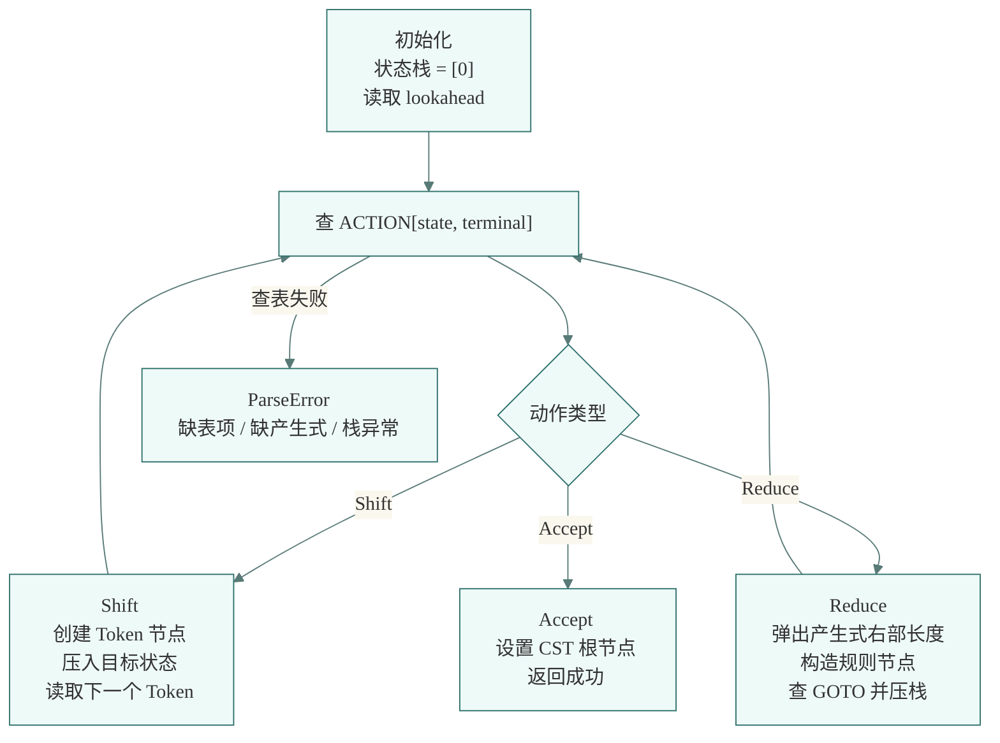

# Parser Flow

```mermaid
%%{init: {"theme": "base", "themeVariables": {"fontFamily": "Arial, PingFang SC, Microsoft YaHei, sans-serif", "primaryColor": "#eefaf8", "primaryBorderColor": "#2f716c", "lineColor": "#597b78", "tertiaryColor": "#fff9e8"}}}%%
flowchart TD
    S["初始化<br/>状态栈 = [0]<br/>读取 lookahead"]
    L["查 ACTION[state, terminal]"]
    A{"动作类型"}
    SHIFT["Shift<br/>创建 Token 节点<br/>压入目标状态<br/>读取下一个 Token"]
    REDUCE["Reduce<br/>弹出产生式右部长度<br/>构造规则节点<br/>查 GOTO 并压栈"]
    ACCEPT["Accept<br/>设置 CST 根节点<br/>返回成功"]
    ERR["ParseError<br/>缺表项 / 缺产生式 / 栈异常"]

    S --> L --> A
    A -->|"Shift"| SHIFT --> L
    A -->|"Reduce"| REDUCE --> L
    A -->|"Accept"| ACCEPT
    L -->|"查表失败"| ERR
```
